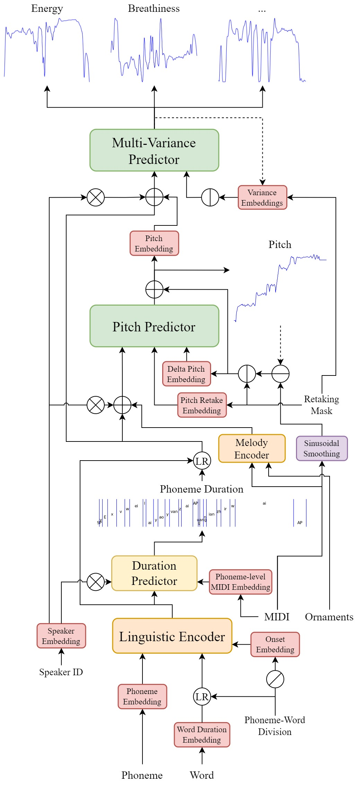
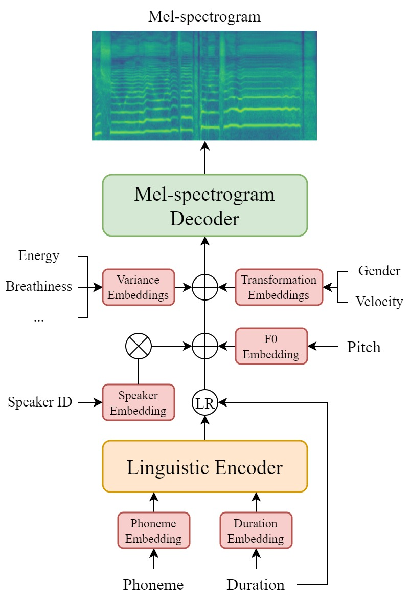

# DiffSinger (OpenVPI maintained version)

This is a refactored and enhanced version of _DiffSinger: Singing Voice Synthesis via Shallow Diffusion Mechanism_ based on the original [paper](https://arxiv.org/abs/2105.02446) and [implementation](https://github.com/MoonInTheRiver/DiffSinger), which provides:

- Cleaner code structure: useless and redundant files are removed and the others are re-organized.
- Better sound quality: the sampling rate of synthesized audio are adapted to 44.1 kHz instead of the original 24 kHz.
- Higher fidelity: improved acoustic models and diffusion sampling acceleration algorithms are integrated.
- More controllability: introduced variance models and parameters for prediction and control of pitch, energy, breathiness, etc.
- Production compatibility: functionalities are designed to match the requirements of production deployment and the SVS communities.

|                                       Overview                                        |                                    Variance Model                                     |                                    Acoustic Model                                     |
|:-------------------------------------------------------------------------------------:|:-------------------------------------------------------------------------------------:|:-------------------------------------------------------------------------------------:|
|  |  |  |

## User Guidance

> 中文教程 / Chinese Tutorials: [Text](https://openvpi-docs.feishu.cn/wiki/KmBFwoYDEixrS4kHcTAcajPinPe), [Video](https://space.bilibili.com/179281251/channel/collectiondetail?sid=1747910)

- **Installation & basic usages**: See [Getting Started](docs/GettingStarted.md)
- **Dataset creation pipelines & tools**: See [MakeDiffSinger](https://github.com/openvpi/MakeDiffSinger)
- **Best practices & tutorials**: See [Best Practices](docs/BestPractices.md)
- **Editing configurations**: See [Configuration Schemas](docs/ConfigurationSchemas.md)
- **Deployment & production**: [OpenUTAU for DiffSinger](https://github.com/xunmengshe/OpenUtau), [DiffScope (under development)](https://github.com/openvpi/diffscope)
- **Communication groups**: [QQ Group](http://qm.qq.com/cgi-bin/qm/qr?_wv=1027&k=fibG_dxuPW5maUJwe9_ya5-zFcIwaoOR&authKey=ZgLCG5EqQVUGCID1nfKei8tCnlQHAmD9koxebFXv5WfUchhLwWxb52o1pimNai5A&noverify=0&group_code=907879266) (907879266), [Discord server](https://discord.gg/wwbu2JUMjj)

## Progress & Roadmap

- **Progress since we forked into this repository**: See [Releases](https://github.com/openvpi/DiffSinger/releases)
- **Roadmap for future releases**: See [Project Board](https://github.com/orgs/openvpi/projects/1)
- **Thoughts, proposals & ideas**: See [Discussions](https://github.com/openvpi/DiffSinger/discussions)

## Architecture & Algorithms

TBD

## Development Resources

TBD

## References

- Original DiffSinger: [paper](https://arxiv.org/abs/2105.02446), [implementation](https://github.com/MoonInTheRiver/DiffSinger)
- [HiFi-GAN](https://github.com/jik876/hifi-gan) and [NSF](https://github.com/nii-yamagishilab/project-NN-Pytorch-scripts/tree/master/project/01-nsf) for waveform reconstruction
- [pc-ddsp](https://github.com/yxlllc/pc-ddsp) for waveform reconstruction
- [DDIM](https://arxiv.org/abs/2010.02502) for diffusion sampling acceleration
- [PNDM](https://arxiv.org/abs/2202.09778) for diffusion sampling acceleration
- [DPM-Solver++](https://github.com/LuChengTHU/dpm-solver) for diffusion sampling acceleration
- [UniPC](https://github.com/wl-zhao/UniPC) for diffusion sampling acceleration
- [RMVPE](https://github.com/Dream-High/RMVPE) and yxlllc's [fork](https://github.com/yxlllc/RMVPE) for pitch extraction

## Disclaimer

Any organization or individual is prohibited from using any functionalities included in this repository to generate someone's speech without his/her consent, including but not limited to government leaders, political figures, and celebrities. If you do not comply with this item, you could be in violation of copyright laws.

## License

This forked DiffSinger repository is licensed under the [Apache 2.0 License](LICENSE).

---

This is the original Readme content of the forked repository openvpi/DiffSinger at the time of the fork.

以上是被 fork 的仓库：openvpi/DiffSinger 在被 fork 时保留的原 Readme 内容。

Here is the Readme content of leisquid/DiffSinger.

以下是 leisquid/DiffSinger 的 Readme 内容。

## leisquid/DiffSinger: Why I forked this repository

If I just forked this repo, I'm not contributing anything to the project. But the only thing I'm afraid of is that something I like, love, or just care about suddenly disappears and I'll be able to find it nowhere, so it's better to own it ahead of time.

如果只是 fork 仓库的话，那么我对这个项目没有任何贡献。但是我就唯独害怕自己喜欢、钟爱、或者只是自己关心的东西突然消失不见，而且到处找不到，不如提前拿到自己的手里更安心。

It is also a response to the attitude of some particular commercial company.

也是对某家商业公司态度的回应。

If I need to use or modify this project in the future, it will continue to be licensed under the Apache 2.0 License for the unchanged parts of [openvpi/DiffSinger](https://github.com/openvpi/DiffSinger), and under the GNU Affero General Public License for the modified parts of leisquid/DiffSinger, and changes will be declared on [./CHANGES.md](./CHANGES.md). See [./LICENSE](./LICENSE).

如果以后我将需要使用或修改此项目，那么对于 [openvpi/DiffSinger](https://github.com/openvpi/DiffSinger) 中未更改的部分，将继续采用 Apache 2.0 License 授权；而对于 leisquid/DiffSinger 中修改的部分，采用 GNU Affero General Public License 授权，并且会在 [./CHANGES.md](./CHANGES.md) 声明变更。详见 [./LICENSE](./LICENSE)。

Thanks.

感谢。

leisquid

24.1.11
